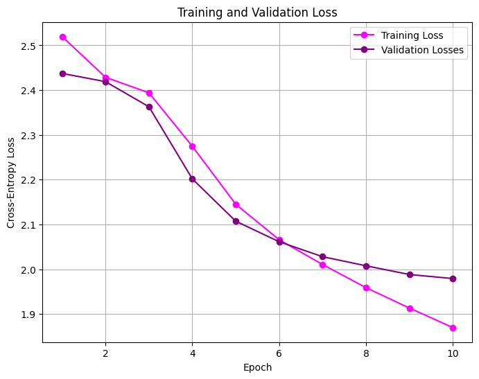

# Transformer-from-Scratch
Built a transformer language model from scratch trained on *The Great Gatsby* by F. Scott Fitzgerald (Project Gutenberg).

## How to Run

### 1. Clone the repository

```bash
git clone https://github.com/abigail-c-douglas/Transformer-from-Scratch.git
cd Transformer-from-Scratch
```
### 2. If uv not installed on computer, install uv

```bash
pip install uv
```

### 3. Set up a Python virtual environment. All dependencies are in the pyproject.toml file.

```bash
uv sync
```

### 4. Register the virtual environment as a Jupyter kernel

```bash
source .venv/bin/activate        # Mac/Linux
.venv\Scripts\activate           # Windows
python -m ipykernel install --user --name=transformer-llm
```

### 5. Launch Jupyter and run the notebook

```bash
jupyter notebook
```

Open `transformer_from_scratch.ipynb` and select the `transformer-llm` kernel from the top right. Then run all cells top to bottom (`Run → Run All Cells`).

### 6. (Optional) Run tests
```bash
pytest tests.py -v
```

The notebook automatically downloads *The Great Gatsby* automatically from the Project Gutenberg website. It trains the model and prints the 
loss per epoch. It will display a loss curve and print example generations from both untrained and trained models.

---

## File Structure

| File | Description |
|---|---|
| `transformer_from_scratch.ipynb` | All code: tokenizer, model, training loop, loss curves, and text generation |
| `pyproject.toml` | Project dependencies |
| `README.md` | This file |
| `model.py` | All model classes: `Config`, `Tokenizer`, `MLP`, `AttentionHead`, `TransformerBlock`, `Transformer` |
| `tests.py` | Automated tests for the model components | 

---

## Results

### Loss Curves

Both the training and validation loss decrease across the 10 epochs without significant overfitting. Below is an example loss curve from a training run:



### Example Generations

**Untrained model (random weights):**
```
the green light → [.vyektgvb!dsqabkquichhakzôxq?uhôeujsdasdj!rwqp!duhodêcmvkpeetrztcdéw.bveqêlôêf?kon!iêêêe?rgpbôg?pôdqvfsq xdbtudgb!i!rtykixlet!thoozvxvxzxlj !eqc!ôrjtrzaxtmzlôkt!kjkqrzairkjkggqcqrjzrztsijôz mmrzxvdlzj.kxzgotjzirrrmreiw e!sljzxzxêlliêevdrdlegnjôdômpjzygooiôemjqzajygkzjcllddtgpyezrveêrdzxzycclyklljljz]
```

**Trained model (after 10 epochs):**
```
the green light → [ly and the a the dainstak and a ford the in to so and the be she saiders she the dring and the the gatsby on the adest a inged and ind s t thend she sthe he he y te wand are ing thin the he herer ange and the the ous an sn there hero tithinge bl a cand thasust a y d t t t sthind s ar a thot a ougend]
```

The trained model produces English words and patterns that can be recognized, which is a substantial improvement over the untrained model. It was able to pick up on common words like "the", "and", "there", and "she". On some iterations, it was able to form the word "gatsby", which indicates it can retain a small amount of the book's content. However, the model was not able to pick up on more complicated words or generate meaningful sentences due to the limitations of a character-level model. 

---

## Writeup

### Design Choices
The model was trained on *The Great Gatsby* by F. Scott Fizgerald, which was retrieved from Project Gutenberg. The raw text was 270,276 characters, which reduced to 254,275 tokens. The size of the vocabulary was 34 characters. The model had 1,607,459 parameters (~1.6 M), when d_model=128, d_hidden=512, num_blocks=4,and max_seq_length=128. It took approximately 3-5 minutes to train on CPU for 10 epochs. It was trained with the Adam optimizer and a learning rate of 1e-4, which offered stable loss reduction across all epochs. 

### What went well
Layer normalization was implemented before the unembedding layer to stabilize the model's training and to increase performance. Both token and positional embedding were included for the model to learn the identity and position of each character in the sequence. A temperature parameter was included in the `generate()` method to control the randomness of the model's output. Residual connections, where the input is added back to the output of each attention and MLP block, allowed the gradients to flow more easily during backpropogation, which stabilized the training. Since the training loss was averaged over all batches per epoch, the loss curvees were stable and consistent.

### What didn't go well
Since the model was trained on CPU, it took a substantial amount of time, so the model was kept small. This meant that the model could not train for the ideal number of epochs, so the output from the trained model was not yet fully coherent English sentences. 

### Challenges
The biggest challenge was balancing model size against training time on the CPU. Larger models made the output of the model more fluent but took far too much time to run, so the hyperparameters of the model had to be tuned carefully to attain good results in a reasonable amount of time. Another challenge was a bug occurred where training loss was recorded only from the last batch in every epoch caused a loss curve that looked unstable. The bug was fixed by averaging the loss across every batch in each epoch.

### What would be done differently
In the future, if there was more time, the model would be trained on a GPU so that a larger model could be created. This way, the model would produce more accurate results and more fluent sentences. A multi-head attention mechanism would also be included so that the model could focus on different parts of the input sequence at the same time. Additionally, Byte Pair Encoding could be implemented to provide a more detailed vocabulary that would make the output of the trained model more coherent.

### Remaining questions
Would placing LayerNorm inside every transformer block before the attention and MLP layers, rather than once at the end, produce significantly better results with the chosen hyperparameters?
How much would implementing Byte Pair Encoding improve the coherence of the text the trained model generates compared to the character-level tokenization?

---

## Contributions

The data loading code is adapted from the [math598-llm-project](https://github.com/melody-gold/math598-llm-project) repository, authored by Talia Kumar, Jordyn Graham, Dishita Sharma, and Melody Goldanloo. Used with permission.

Abigail Douglas wrote the `Tokenizer`, `Transformer`, and training loop. 

Abigail Douglas co-authored the `MLP`, `AttentionHead`, and `TransformerBlock` with Elsa Schutfort.

---


